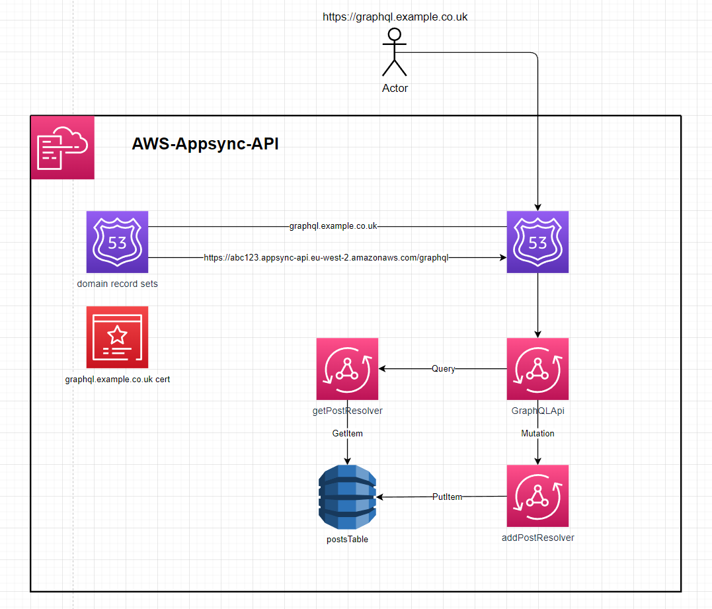
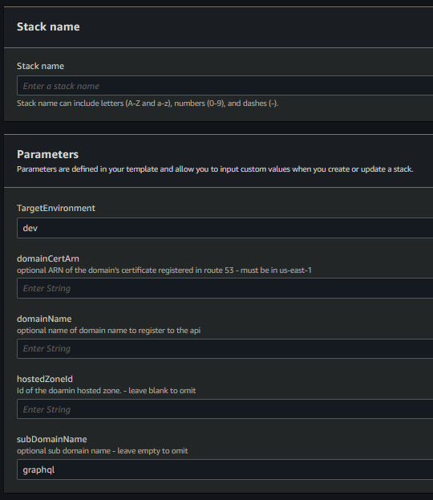
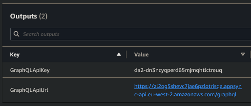
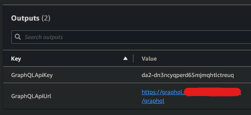

# Appsync GraphQl API  

This template.yaml defines an `AppSync API` that uses dynamo resolvers to directly interface with a dynamo table  

  

---

# Setup:  
1. deploy the template - speficy stack parameters  
  
   1.  setup without a domain
       -  leave the `domainCertArn`, `domainName`, `hostedZoneId` & `subDomainName` blank. The stack outputs will be the `API url` & an `API token`
  
   2.  setup with a domain
       -  enter a value for `domainCertArn`, `domainName` & `hostedZoneId`. This will create an Appsync domain association and a route53 record
   3.  setup with a domain and subdomain
       -  enter a value for `domainCertArn`, `domainName`, `hostedZoneId` & `subDomainName`. This will create an Appsync domain association and a route53 record for `subDomainName.domainName`
  

---

# Usage  
**creating a post**  
```graphql
mutation addPost {
  addPost(
    author: "AUTHORNAME"
    title: "Our first post!"
    content: "This is our first post."
    url: "https://aws.amazon.com/appsync/"
  ) {
    id
    author
    title
    content
    url
  }
}
```
This mutation will return:  
```json
{
    "data": {
        "addPost": {
            "id": "8b909b4c-77c0-4aab-a44f-34e7fd7e04b7",
            "author": "AUTHORNAME",
            "title": "Our first post!",
            "content": "This is our first post.",
            "url": "https://aws.amazon.com/appsync/"
        }
    }
}
```
This `id` can be used with the `getPost` Query  

---
**getting a post**
```graphql
query getPost {
  getPost(id: "8b909b4c-77c0-4aab-a44f-34e7fd7e04b7") {
    id
    author
    title
    content
    url
  }
}
```
This query will return:  
```json
{
    "data": {
        "getPost": {
            "id": "8b909b4c-77c0-4aab-a44f-34e7fd7e04b7",
            "author": "AUTHORNAME",
            "title": "Our first post!",
            "content": "This is our first post.",
            "url": "https://aws.amazon.com/appsync/"
        }
    }
}
```
